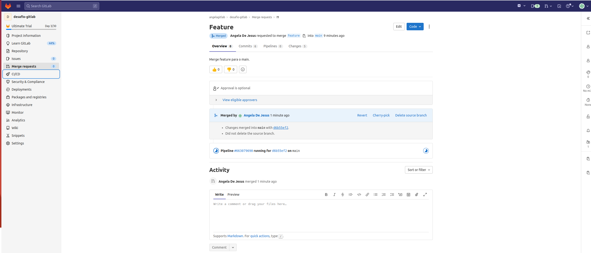

1. Repositório público chamado "desafio-gitlab" e clone-o em seu computador.

2. Arquivos do desafio ao seu repositório local e faça o primeiro commit.  
   Push do repositório local para o repositório remoto.


3. Mudança do texto da página inicial para "Desafio GitLab - Dev".


4. Nova branch chamada "feature" e alteração do texto da página inicial para "Desafio GitLab - Feature".


5.Pipeline no GitLab CI para fazer o deploy do site estático no GitLab Pages.


6. Merge da branch "feature" para a branch "main".

Resolvendo Conflito do Merge


7. Endereço do site no GitLab.<br>
```https://angelagitlab.gitlab.io/desafio-gitlab/```<br>
