# Respostas Desafio GitLab 

### 1. Repositório público chamado "desafio-gitlab" e clonado no computador.
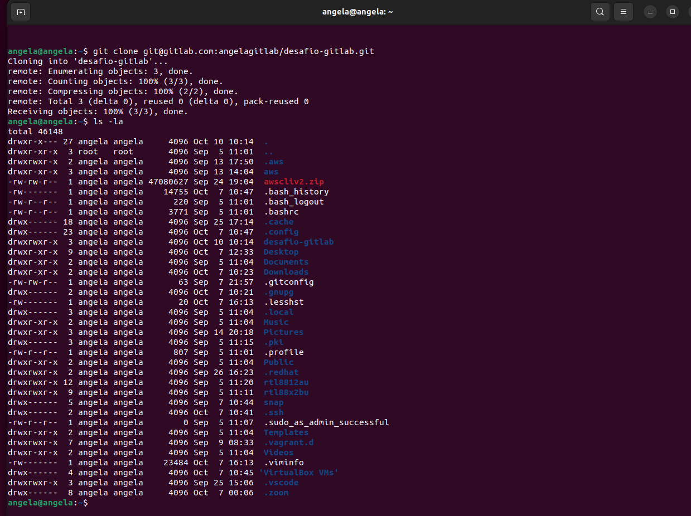
### 2. Arquivos do desafio no repositório local e primeiro commit realizado.  
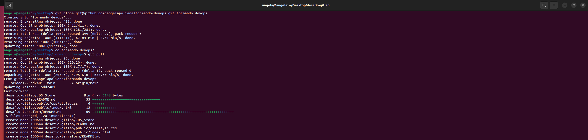
### Push do repositório local para o repositório remoto.
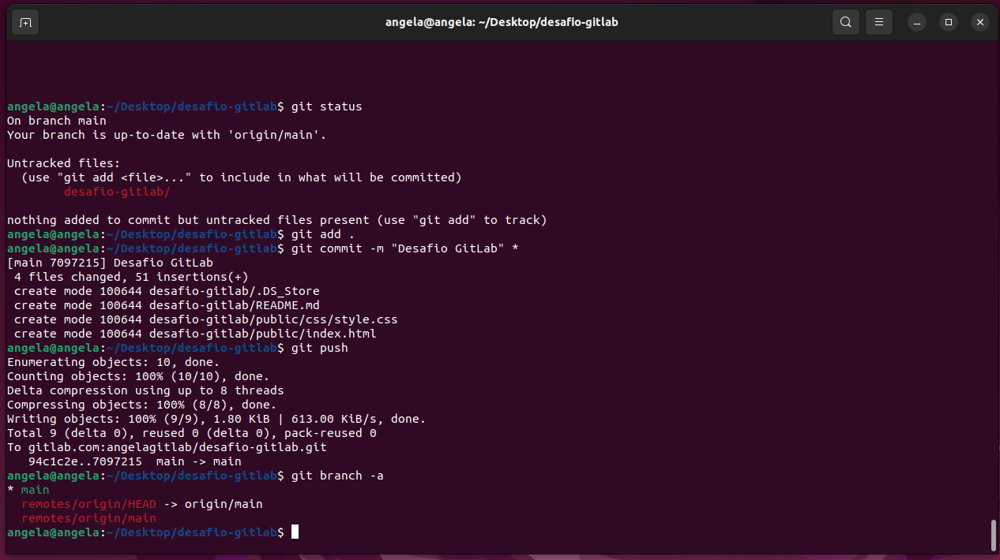
### 3. Mudança do texto da página inicial para "Desafio GitLab - Dev".
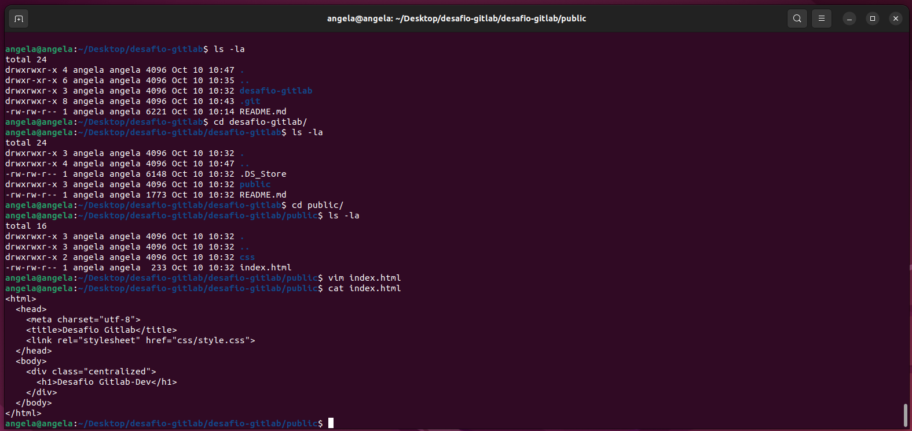
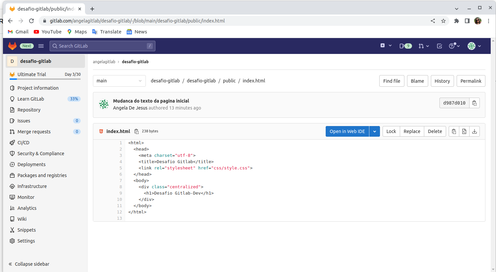
### 4. Nova branch chamada "feature" e alteração do texto da página inicial para "Desafio GitLab - Feature".
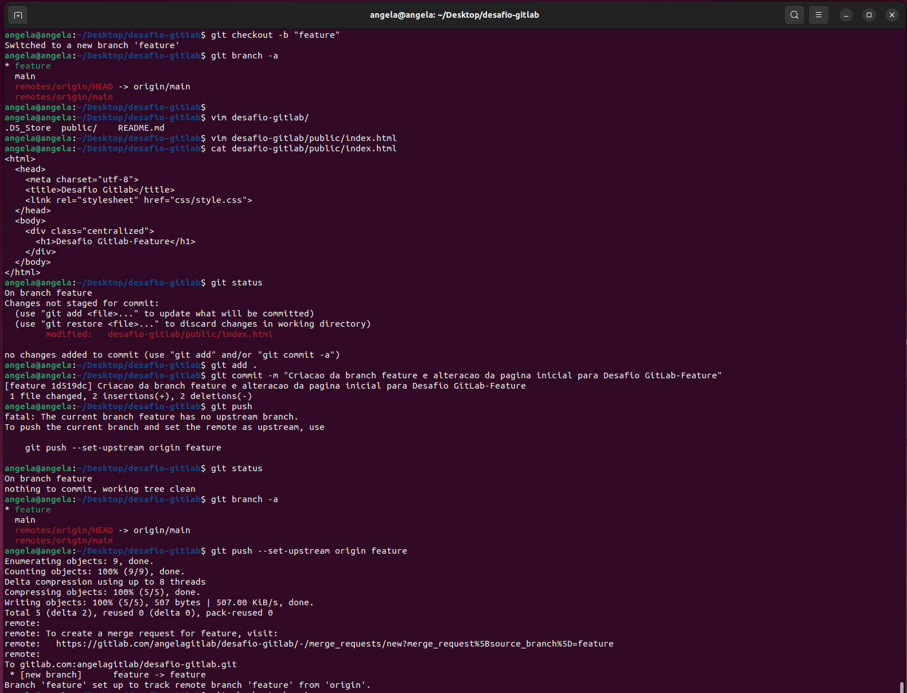
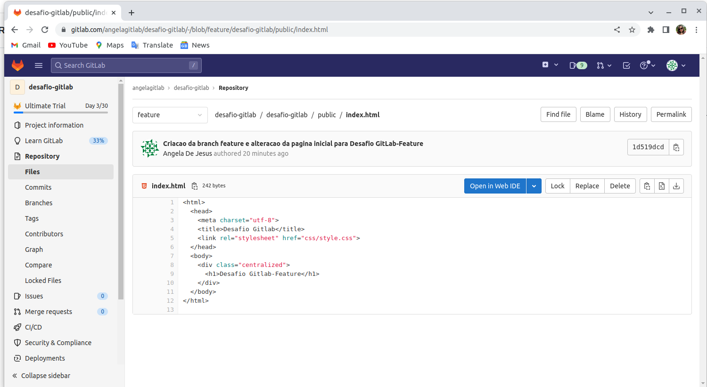
### 5. Pipeline no GitLab CI para fazer o deploy do site estático no GitLab Pages.
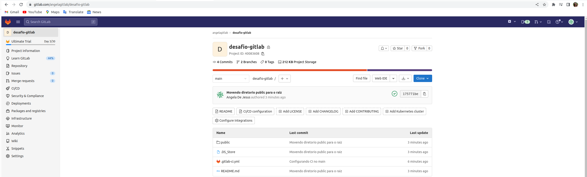
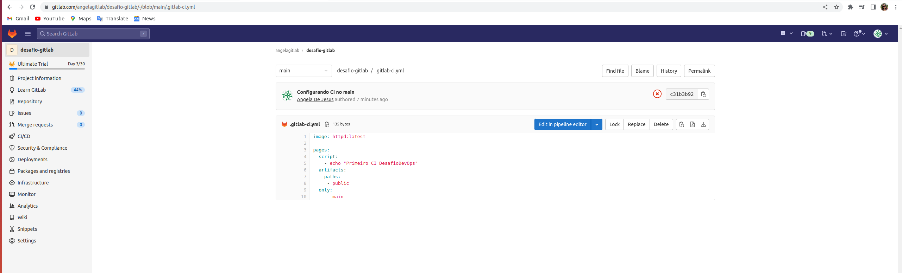
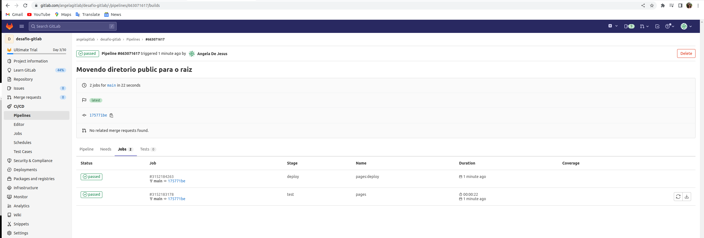
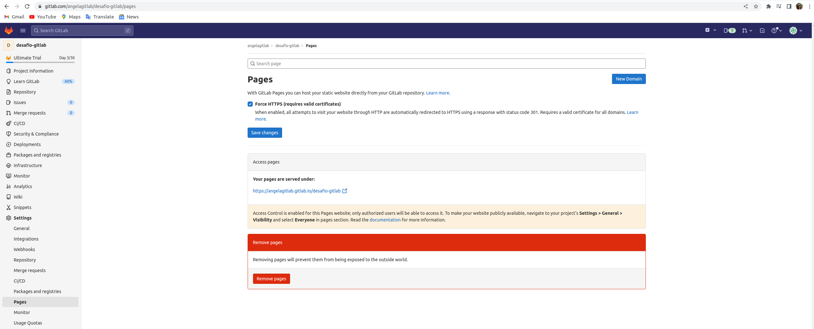
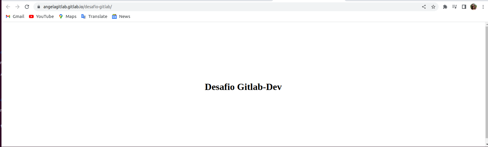
### 6. Merge da branch "feature" para a branch "main".
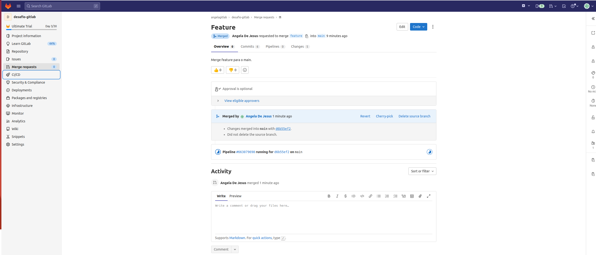
### Resolvendo Conflito do Merge
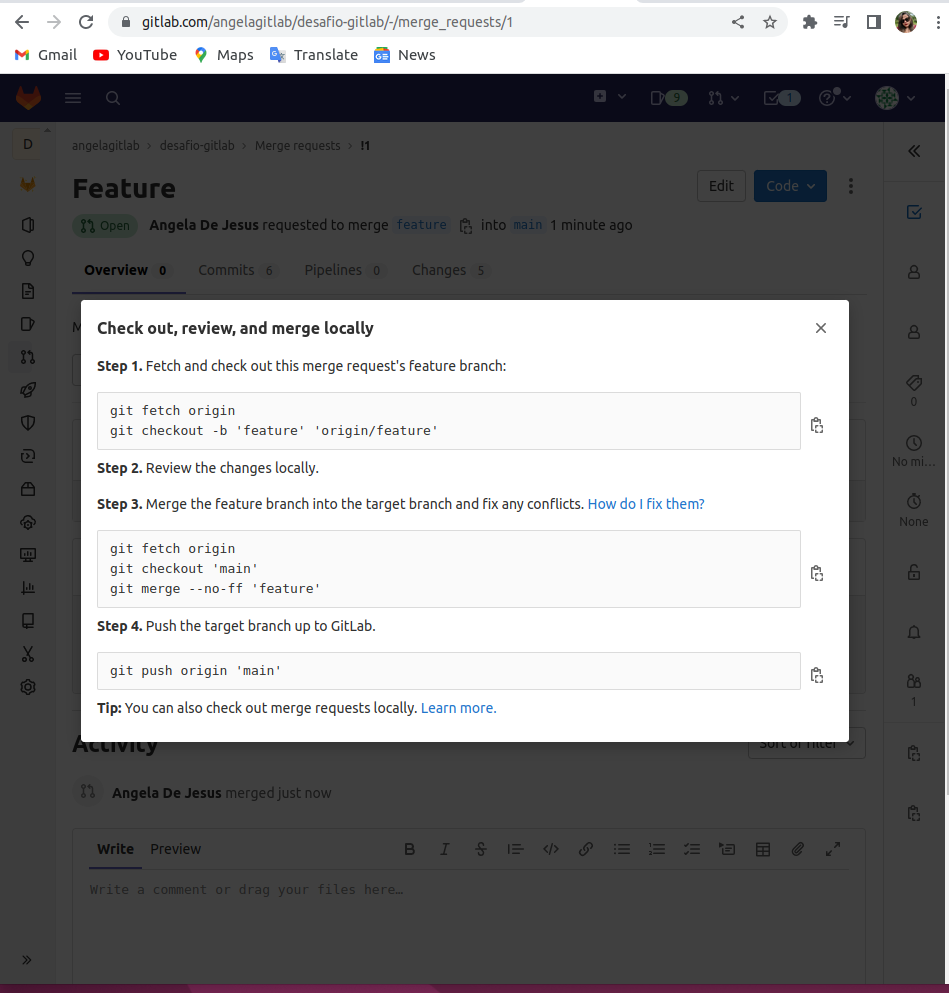
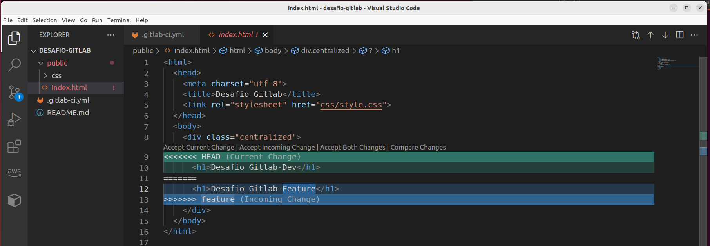
### 7. Endereço do site no GitLab. 
[https://angelagitlab.gitlab.io/desafio-gitlab/](https://angelagitlab.gitlab.io/desafio-gitlab/) 
### 8. Página inicial do projeto no Gitlab com o texto alterado.. 
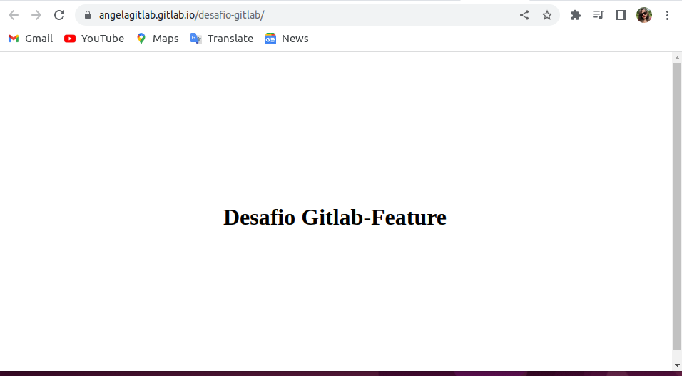
